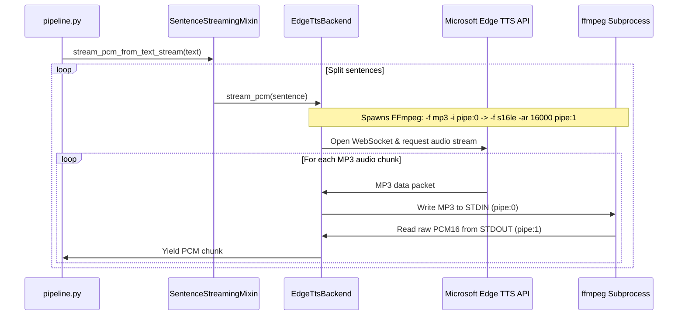

# 🎙️ Detailed TTS Service Documentation

This document provides a comprehensive overview of the **Text-to-Speech (TTS)** component within the VoiceBot STT-TTS microservice.

---

## 🏗️ Architecture & Processing Flow

The TTS service converts text replies into playable audio. It is designed to be **streaming-first** to minimize the Time to First Audio (TTFA).



### 1. The Real-time Decoding Pipeline
Unlike traditional setups that download an entire audio file before playing it, the `EdgeTtsBackend` uses a **pipelined stdout transcoder**:
1. It opens a WebSocket connection to the Microsoft Edge TTS server using `edge_tts.Communicate`.
2. It simultaneously spawns an `ffmpeg` subprocess with standard input and output redirected to pipes (`stdin=PIPE`, `stdout=PIPE`).
3. As MP3 chunks arrive from Microsoft over the network, they are written directly to `ffmpeg`'s `stdin`.
4. `ffmpeg` decodes the MP3 stream into raw **PCM 16-bit Little-Endian mono (s16le)** at the target sample rate (default 16kHz) and writes it to `stdout`.
5. A background reader coroutine pulls these raw PCM bytes from `ffmpeg`'s `stdout` and puts them into a queue, making the first audio byte available in **~350–500ms**.

### 2. Sentence-by-Sentence Splitting (`SentenceStreamingMixin`)
To further reduce latency, the [SentenceStreamingMixin](file:///d:/Technossus/Bikku/Voice/STT-TTS/services/streaming_tts.py#L251) splits long text replies into sentence chunks using regex:
`(?<=[.!?])\s+|(?<=[.!?])$`
* Rather than waiting for the entire paragraph to synthesize, TTS starts generating audio for the **first sentence immediately**.
* Subsequent sentences are synthesized sequentially or in parallel, hiding their latency behind the playback duration of the first sentence.

### 3. Pacing Algorithm
When streaming audio for live playout (e.g., WebRTC/RTP), sending bytes too quickly will overflow the client-side buffers, while sending them too slowly causes stuttering. The `StreamingTtsService` implements a **monotonic pacing generator**:
* **Sample Calculation**:
  $$\text{Expected Duration (s)} = \frac{\text{Cumulative Bytes Yielded}}{\text{Sample Rate} \times \text{Sample Width} \times \text{Channels}}$$
  For 16kHz, 16-bit (2 bytes) mono:
  $$\text{Expected Duration} = \frac{\text{Bytes}}{16000 \times 2 \times 1} = \frac{\text{Bytes}}{32000}$$
* **Delay**: The system tracks the elapsed wall time since the stream started (`time.monotonic() - stream_start`). If the expected audio duration is greater than the elapsed wall time, the thread sleeps for the difference:
  $$\text{sleep\_s} = \text{Expected Duration} - \text{Elapsed Time}$$

---

## 📂 Codebase & Module Directory

* **[main.py](file:///d:/Technossus/Bikku/Voice/STT-TTS/main.py)**: Exposes the FastAPI HTTP routing layers, including the `/tts`, `/tts/stream`, `/tts/pcm-stream`, and `/synthesise` endpoints.
* **[services/streaming_tts.py](file:///d:/Technossus/Bikku/Voice/STT-TTS/services/streaming_tts.py)**: The core engine containing the `EdgeTtsBackend`, pacing calculations, queue orchestration, and language split mixins.
* **[services/tts_service.py](file:///d:/Technossus/Bikku/Voice/STT-TTS/services/tts_service.py)**: Exposes a synchronous facade (`TTSService`) for batch operations, wrapping streaming data into static WAV containers.
* **[services/tts_normalizer.py](file:///d:/Technossus/Bikku/Voice/STT-TTS/services/tts_normalizer.py)**: Normalizes numbers, dates, times, currencies, and special characters into text words before sending them to the TTS engine (e.g., *"10 AM"* $\rightarrow$ *"ten a m"*).
* **[services/tts_util.py](file:///d:/Technossus/Bikku/Voice/STT-TTS/services/tts_util.py)**: Basic conversion helpers.

---

## 🌐 HTTP API Endpoints

### 1. `POST /tts` (Batch JSON response)
Takes text input and returns a JSON payload containing base64-encoded WAV audio.
* **Request Body:**
  ```json
  {
    "text": "Your appointment is confirmed.",
    "voice": "default",
    "format": "wav"
  }
  ```
* **Response Body:**
  ```json
  {
    "audio_base64": "UklGRi...",
    "duration": 2.15,
    "format": "wav",
    "char_count": 30
  }
  ```

### 2. `POST /tts/stream` (Direct binary file response)
Identical to `/tts` but returns the raw binary file directly as a download with the appropriate MIME headers (`audio/wav` or `audio/mpeg`).
* **Headers returned:**
  * `X-Audio-Duration`: Estimated audio length in seconds.
  * `X-Char-Count`: Number of characters processed.

### 3. `POST /tts/pcm-stream` (Real-time raw PCM chunk streaming)
Streams raw PCM bytes (no containers or headers) over an HTTP Chunked Transfer Response. This is designed for WebRTC/RTP telephony gateways.
* **Request Body:**
  ```json
  {
    "text": "Hello, how can I help you?",
    "chunk_ms": 20,
    "session_id": "call-session-abc"
  }
  ```
* **Response:** Content-Type `audio/L16;rate=16000;channels=1`. Streams raw 640-byte binary chunks every 20ms.

---

## ⚙️ Configuration Variables (`.env`)

Configure these variables in your root [.env](file:///d:/Technossus/Bikku/Voice/STT-TTS/.env) file:

| Variable Name | Default Value | Description |
| :--- | :---: | :--- |
| `TTS_PROVIDER` | `edge` | Options: `edge`. (Determines backend engine). |
| `TTS_TARGET_SAMPLE_RATE` | `16000` | Target sample rate for output PCM (in Hz). |
| `EDGE_TTS_EN_VOICE` | `en-IN-NeerjaNeural` | Microsoft neural voice used for English replies. |
| `EDGE_TTS_HI_VOICE` | `hi-IN-SwaraNeural` | Microsoft neural voice used for Hindi replies. |
| `EDGE_TTS_SPEED` | `+0%` | Adjusts playback speed. Slower: `-10%`, Natural: `+0%`, Faster: `+10%`. |
| `STREAMING_TTS_CHUNK_MS` | `20` | Size of streaming audio packages in milliseconds. |
| `TTS_MIN_SENTENCE_CHARS` | `20` | Minimum character length before sentence-splitting kicks in. |
| `FFMPEG_PATH` | `ffmpeg` | Path to the `ffmpeg` executable on the system. |

---

## 🛠️ Diagnostics & Verification

### Running Standalone Test Scripts
You can verify the TTS setup without running the entire FastAPI application:

1. **Verify direct library synthesis and pydub conversion:**
   ```bash
   .venv\Scripts\python.exe verify_tts.py
   ```
2. **Verify streaming pipeline and chunk latency:**
   ```bash
   .venv\Scripts\python.exe verify_tts_direct.py
   ```

---

## 🚨 Troubleshooting Common Quality Issues

### 1. Metallic/Buzzing Pitch Distortion ("Guitter" Sound)
* **Cause:** If the voice sounds squeaky, vibrates like a guitar string, or breaks up, check `EDGE_TTS_SPEED` in your `.env` file. Setting this to high values (e.g., `+35%`) causes neural vocoder artifacts.
* **Solution:** Lower `EDGE_TTS_SPEED` to `+0%`, `+5%`, or `+10%`.

### 2. Choppy/Stuttered Audio Playback
* **Cause:** The generator `self._backend.stream_pcm()` contains a synchronous blocking queue read (`pcm_queue.get(timeout=20)`). When run within the FastAPI async event loop, this blocks the server thread, causing pacing delays to become highly erratic and triggering buffer underflows on the client.
* **Solution:** Modify `stream_pcm` in `streaming_tts.py` to use an `asyncio.Queue` and spawn the blocking generator in a background thread using standard Python `threading`.
