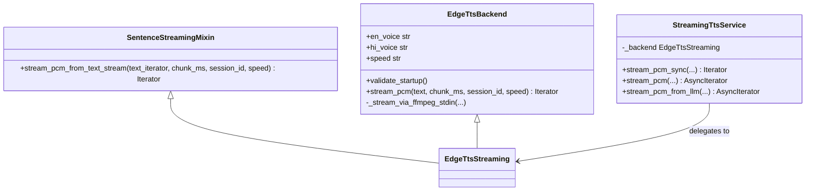

# `services/streaming_tts.py` Technical Documentation

This module manages the real-time, low-latency streaming Text-to-Speech (TTS) engine for the VoiceBot. It integrates Microsoft Edge's Neural TTS API with a local `ffmpeg` subprocess to deliver raw PCM16 audio chunks on the fly.

---

## 🛠️ Module Architecture

The module utilizes a modular, class-based composition model:



---

## 🧵 Threading & Concurrency Model

To achieve low-latency audio delivery without freezing the FastAPI web server, `streaming_tts.py` uses a **three-tier thread/asyncio model**:

1. **Subprocess Threading**: `EdgeTtsBackend` launches an `ffmpeg` subprocess. The standard input (MP3 bytes) is fed by an async writer coroutine, and the standard output (PCM16 bytes) is read by an async reader coroutine. Both run concurrently in a dedicated background event loop thread spawned by standard Python `threading.Thread`.
2. **Main Thread Non-Blocking Queue**: In `StreamingTtsService.stream_pcm`, the backend generator is synchronous. To prevent blocking the main asyncio event loop, the service runs the backend iterator in a daemon thread. Chunks are dispatched to the main thread by calling `asyncio.run_coroutine_threadsafe(queue.put(chunk), loop)`.
3. **Pacing Engine**: The main thread fetches chunks from the `asyncio.Queue` asynchronously via `await queue.get()` and executes high-precision monotonic pacing sleeps (`asyncio.sleep`) to simulate real-time playout.

---

## 🔍 Code Walkthrough

### 1. `EdgeTtsBackend` (Low-Level Transcoder)
Manages the lifetime of the `ffmpeg` subprocess and processes incoming audio packets.
* **FFmpeg Arguments**:
  * `-f mp3 -i pipe:0`: Inputs raw MP3 streaming bytes from stdin.
  * `-f s16le -ar 16000 -ac 1 pipe:1`: Outputs raw 16kHz 16-bit mono Little-Endian PCM stream to stdout.
* **Subprocess Communication**:
  * `proc.stdin.write(chunk["data"])` + `proc.stdin.drain()` writes incoming network chunks.
  * `proc.stdout.read(4096)` buffers raw decoded PCM bytes and splits them into aligned `chunk_bytes` blocks.

### 2. `SentenceStreamingMixin` (Text Tokenizer)
Tokenizes streams of incoming LLM text tokens on natural sentence-ending boundaries: `(?<=[.!?])\s+|(?<=[.!?])$`.
* Ensures that chunks are at least `MIN_SENTENCE_CHARS` (default: 5) to ensure the neural model has sufficient linguistic context for realistic speech prosody (intonation).

### 3. `StreamingTtsService` (Public Async API Facade)
Exposes three methods for consuming synthesized audio:

#### `stream_pcm_sync`
```python
def stream_pcm_sync(
    self, text: str, chunk_ms: int, session_id: str, speed: float
) -> Iterator[bytes]:
```
* **Use Case**: Batch operations (e.g., generating static audio files in the background).
* **Behavior**: Returns a synchronous iterator that yields decoded PCM chunks as fast as the network and CPU can process them (no sleep/pacing).

#### `stream_pcm`
```python
async def stream_pcm(
    self, text: str, chunk_ms: int, session_id: str, speed: float
) -> AsyncIterator[bytes]:
```
* **Use Case**: Direct real-time streaming of complete sentences.
* **Behavior**: Wraps the backend iterator in a background thread and applies monotonic pacing (`samples_yielded / TARGET_SAMPLE_RATE` vs `time.monotonic()`) to yield chunks at exact real-time playback intervals.

#### `stream_pcm_from_llm`
```python
async def stream_pcm_from_llm(
    self, text_iterator, chunk_ms: int, session_id: str, speed: float
) -> AsyncIterator[bytes]:
```
* **Use Case**: Concurrent LLM token streaming $\rightarrow$ TTS synthesis.
* **Behavior**: Accepts an LLM token iterator. Generates audio sentence-by-sentence in a background worker thread, allowing the bot to start speaking while the LLM is still generating subsequent tokens.

---

## ⚙️ Module Dependencies & Setup
The module requires the following dependencies from `requirements.txt`:
* `edge-tts`: Python client interface to Microsoft Edge's Neural TTS.
* `ffmpeg`: Executable binary required on the system PATH (configured via `FFMPEG_PATH` in `.env`).
* `asyncio`, `threading`, `time`, `logging`, `re`: Core Python standard library modules.
